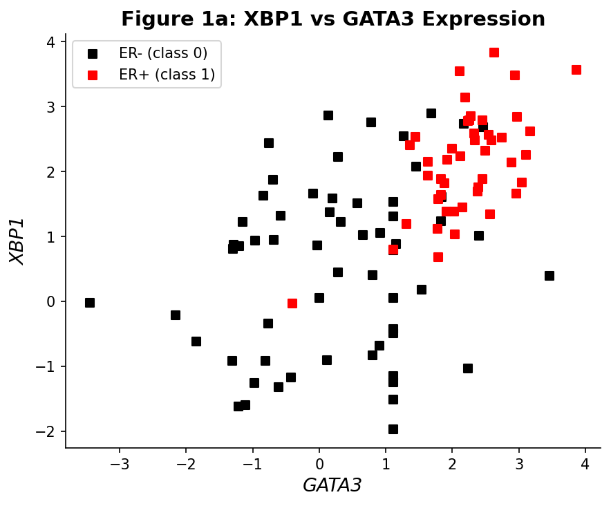
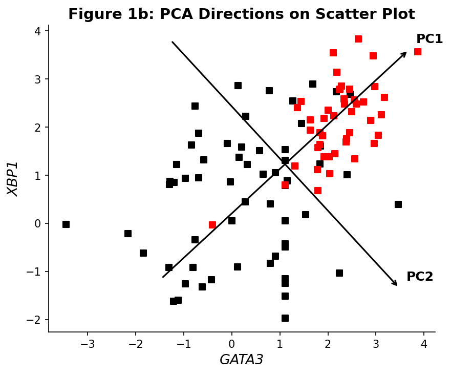
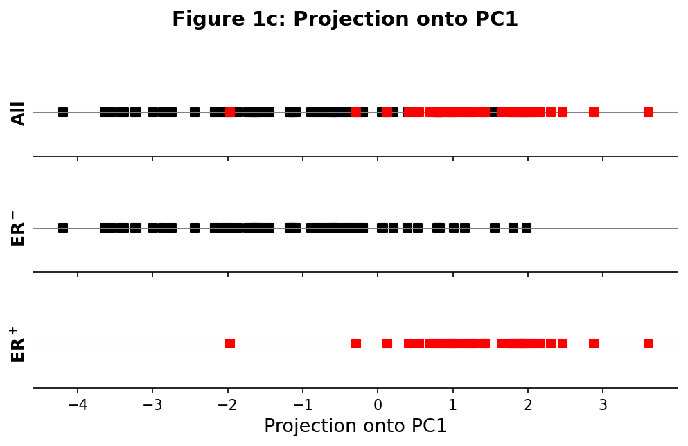

# Analyzing Breast Cancer Gene Expression with PCA

**Name:** Tanish  
**Dataset:** GSE5325 (Gene Expression Omnibus)  
**Reference:** Ringner, M. "What is principal component analysis?" *Nature Biotechnology*, 26, 303–304 (2008)

---

## 1. Overview

Principal Component Analysis (PCA) is a dimensionality reduction technique that finds new axes (called principal components) along which the data varies the most. In this project, we apply PCA to gene expression data from 105 breast cancer patients to explore how well two genes — **XBP1** and **GATA3** — can distinguish between **ER+ (estrogen receptor positive)** and **ER- (estrogen receptor negative)** tumors. ER status is clinically important since it guides the choice of treatment.

Our goal is to reproduce the key panels of Figure 1 from the referenced Nature Biotechnology primer on PCA.

## 2. About the Data

The dataset is sourced from GEO accession [GSE5325](https://www.ncbi.nlm.nih.gov/geo/query/acc.cgi?acc=GSE5325). It includes expression profiles for 105 breast cancer patients across 16,174 genes.

**Patient breakdown:**
- **ER+ (class 1):** 45 patients
- **ER- (class 0):** 60 patients
- **Total:** 105 patients

The data is organized into three files:

| File | Contents |
|------|----------|
| `data/class.tsv` | Patient labels: 1 for ER+, 0 for ER- |
| `data/filtered.tsv.gz` | Full expression matrix (105 × 16,174) |
| `data/columns.tsv.gz` | Mapping from gene IDs to gene names |

From the mapping file, we identified:
- Gene ID **4404** → **XBP1** (X-box binding protein 1)
- Gene ID **4359** → **GATA3** (GATA binding protein 3)

## 3. Approach

### 3.1 Gene Extraction

We pulled out the expression values for XBP1 and GATA3 from the full expression matrix using their gene IDs. This results in a 105 × 2 data matrix, with GATA3 and XBP1 as the two features.

### 3.2 Manual PCA Steps

We performed PCA from scratch (without any library like sklearn) on the 2D data. The procedure was:

1. **Mean-center the data:** Subtract the average expression of each gene across all 105 patients.
2. **Compute covariance matrix:** Calculate the 2×2 covariance matrix from the centered data.
3. **Eigendecomposition:** Find eigenvalues and eigenvectors of the covariance matrix.
4. **Order by variance:** Sort the eigenvectors so that the one with the largest eigenvalue comes first — this is PC1.
5. **Project:** Take the dot product of each centered data point with PC1 to get a 1D representation.

The resulting covariance matrix was:

```
[[2.0587, 1.0972],
 [1.0972, 1.8837]]
```

Eigenvalues: **3.0719** (PC1) and **0.8705** (PC2). This means PC1 accounts for **77.9%** of the total variance.

## 4. Results and Observations

### 4.1 Figure 1a — XBP1 vs GATA3 Scatter Plot

We plotted XBP1 on the y-axis against GATA3 on the x-axis, with points colored by ER status:
- **Black squares:** ER- patients
- **Red squares:** ER+ patients



**What we see:** ER+ patients generally exhibit higher expression of both genes and cluster toward the upper-right region of the plot. ER- patients are more scattered and tend to sit in the lower-left area. There is a clear positive correlation between GATA3 and XBP1 expression, and the two classes are visibly separated. This closely matches Figure 1a from the reference paper.

### 4.2 Figure 1b — Principal Component Directions

This plot is the same as Figure 1a, but with PC1 and PC2 drawn as arrows passing through the data mean. These arrows show the directions of greatest and least variance.



**What we see:** The PC1 arrow runs from the lower-left to the upper-right, aligned with the direction that best separates the two patient groups. PC2 is perpendicular to PC1 and captures the remaining (smaller) variance. These two directions define a new coordinate system that is more informative for distinguishing tumor types than the original gene axes. This reproduces Figure 1b from the paper.

### 4.3 Figure 1c — 1D Projection onto PC1

We projected all 105 centered data points onto the PC1 axis and displayed the results as three horizontal strip plots:

1. **All** — Both groups shown together
2. **ER⁻** — 60 ER- patients (black)
3. **ER⁺** — 45 ER+ patients (red)



**What we see:** ER- patients are concentrated on the left (negative projection values), while ER+ patients fall on the right (positive values). Although there is some overlap in the center, the overall separation is clear. This confirms that projecting onto PC1 alone preserves most of the meaningful variation between the two groups — a key demonstration of the power of PCA for dimensionality reduction.

## 5. Discussion

- The first principal component (PC1) captures **77.9%** of the total variance in the 2D gene expression space, indicating that a single direction accounts for most of the variation.
- This dominant direction coincides with the positive correlation between XBP1 and GATA3 expression and aligns well with ER status.
- PCA was able to reduce the 2D data to 1D while retaining the biologically relevant separation between ER+ and ER- tumors.
- Even with just two genes, PCA effectively reveals the underlying structure of the data — illustrating why it is a widely used tool in genomics and data analysis.

## 6. Conclusion

We applied PCA to the expression levels of XBP1 and GATA3 in 105 breast cancer patients and successfully reproduced the main panels of Figure 1 from the Nature Biotechnology primer. The scatter plot (Figure 1a) reveals distinct clustering by ER status, the direction plot (Figure 1b) shows how PCA orients its axes along maximum variance, and the 1D projection (Figure 1c) demonstrates that PC1 alone is sufficient to largely separate ER+ from ER- tumors. These results highlight the utility of PCA as a simple yet powerful dimensionality reduction technique.

---

## Code

The full implementation is in `pca_analysis.py`. It uses numpy (for eigendecomposition and linear algebra), pandas (for loading and handling data), and matplotlib (for generating the plots).
